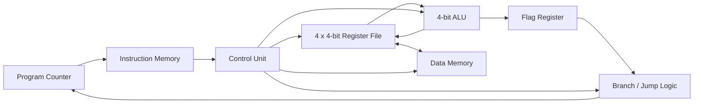

# Verilog Mini CPU

A compact 4-bit educational CPU written in Verilog. The design includes a register file, ALU, data memory, control unit, program counter with branch/jump support, instruction memory, ALU flags, waveform generation, and self-checking testbenches.

This project is intentionally small enough to study in one sitting while still demonstrating the structure of a real hardware-design workflow: modular RTL, instruction decode, simulation, verification, and reproducible builds.

## Architecture



The CPU executes one instruction per clock when `run_enable` is high:

1. `pc` selects a 16-bit instruction from instruction memory.
2. The control unit decodes the instruction class (ALU, branch, jump, or memory), opcode/condition, registers, and immediate/offset/address.
3. The register file provides operands.
4. For ALU instructions, the ALU computes a result and flags, which are written back to the destination register and latched into the flag register.
5. For memory instructions, a register is stored to data memory, or data memory is loaded into a register.
6. For branch instructions, the latched flags decide whether `pc` jumps by the signed offset; for jump instructions, `pc` is set to the target address. Otherwise `pc` increments by one.

## Instruction Format

Each instruction is 16 bits. The top two bits select an instruction class, which determines how the remaining bits are interpreted:

| Bits | Field | ALU (`00`) | Branch (`01`) | Jump (`10`) | Load/Store (`11`) |
|------|-------|------------|----------------|-------------|---------------------|
| `[15:14]` | `class` | `00` | `01` | `10` | `11` |
| `[13:11]` | — | `alu_op` | `cond` (condition code) | unused (`000`) | bit `13` = `0` load / `1` store, bits `12:11` unused |
| `[10:9]`  | — | `dest` (destination register) | unused | unused | `dest` (load destination register) |
| `[8:7]`   | — | `src_a` (first source register) | unused | unused | `src_a` (store source register) |
| `[6:5]`   | — | `src_b` (second source register) | unused | unused | unused |
| `[4]`     | — | `use_immediate` | unused | unused | unused |
| `[3:0]`   | — | `immediate` | signed branch offset | jump target address | memory address |

Unused bit positions should be encoded as `0`.

## ALU Operations

| Opcode | Operation | Description |
|--------|-----------|-------------|
| `000` | `ADD` | `A + B` |
| `001` | `SUB` | `A - B` |
| `010` | `AND` | Bitwise AND |
| `011` | `OR` | Bitwise OR |
| `100` | `XOR` | Bitwise XOR |
| `101` | `SLL` | Logical left shift by `B[1:0]` |
| `110` | `SRL` | Logical right shift by `B[1:0]` |
| `111` | `SLT` | Unsigned set-less-than |

The ALU exposes four flags:

| Flag | Meaning |
|------|---------|
| `zero` | Result is `0000` |
| `negative` | Result bit 3 is set |
| `carry` | ADD carry-out, SUB borrow, or shifted-out bit |
| `overflow` | Signed overflow for ADD/SUB |

After each ALU instruction, these flags are latched into a flag register for use by the next branch instruction.

## Control Flow

Branch instructions (`class = 01`) compare the latched flags against a condition code in `[13:11]` and, if met, add the signed 4-bit offset in `[3:0]` to `pc` (`pc <= pc + offset`, wrapping modulo 16). If the condition is not met, `pc` simply increments as usual.

| Condition | Mnemonic | Taken when |
|-----------|----------|------------|
| `000` | `BEQ` | `zero` is set |
| `001` | `BNE` | `zero` is clear |
| `010` | `BLT` | `negative` is set |
| `011` | `BGE` | `negative` is clear |
| `100` | `BCS` | `carry` is set |
| `101` | `BCC` | `carry` is clear |
| `110` | `BVS` | `overflow` is set |
| `111` | `BRA` | always |

Jump instructions (`class = 10`) are unconditional: `pc <= immediate` (the 4-bit target address in `[3:0]`).

## Memory Operations

Load/store instructions (`class = 11`) access a 16 x 4-bit data memory:

- **Load** (`[13] = 0`): `dest <= data_memory[address]`, where `dest` is `[10:9]` and `address` is `[3:0]`.
- **Store** (`[13] = 1`): `data_memory[address] <= src_a`, where `src_a` is `[8:7]` and `address` is `[3:0]`.

## Project Structure

```text
.
├── src/
│   ├── alu.v
│   ├── control_unit.v
│   ├── data_memory.v
│   ├── instruction_memory.v
│   ├── register_file.v
│   └── top.v
├── tb/
│   ├── alu_tb.v
│   ├── data_memory_tb.v
│   ├── register_file_tb.v
│   └── top_tb.v
├── Makefile
├── README.md
└── LICENSE
```

## Verification

The test suite uses self-checking Verilog testbenches:

| Testbench | Coverage |
|-----------|----------|
| `alu_tb.v` | ALU operations and flags |
| `register_file_tb.v` | Reset, writes, and asynchronous reads |
| `data_memory_tb.v` | Reset, writes, and asynchronous reads |
| `top_tb.v` | Instruction loading, register loading, PC stepping, ALU execution, writeback, store/load, conditional branches, and jumps |

The full-system test loads this short program:

```text
R2 = R0 + R1
R3 = R0 - R1
R2 = R2 & 8
R2 = R2 << 1
R3 = R0 < R1
mem[5] = R3
R1 = mem[5]
R2 = R1 - R1          ; sets the zero flag
BNE +3                ; not taken (zero flag is set)
BEQ +3                ; taken, skips the next two slots
JMP 0
```

## Running the Project

### Prerequisites

- [Icarus Verilog](https://steveicarus.github.io/iverilog/)
- [GTKWave](https://gtkwave.sourceforge.net/) for waveform inspection

### Run all tests

```bash
make test
```

Expected output:

```text
alu_tb: PASS
register_file_tb: PASS
data_memory_tb: PASS
top_tb: PASS
```

### Run individual tests

```bash
make test-alu
make test-register-file
make test-data-memory
make test-top
```

### View waveforms

The top-level testbench writes `waveform.vcd`.

```bash
make test-top
gtkwave waveform.vcd
```

### Clean generated files

```bash
make clean
```

## Project Highlights

This project demonstrates:

- RTL module decomposition
- ALU design and flag handling
- Register-file read/write behavior
- Instruction decoding with multiple instruction classes
- Program-counter based execution with conditional branches and jumps
- Data memory load/store
- Simulation-driven verification
- Make-based reproducible test runs


## License

Licensed under Apache-2.0. See [LICENSE](LICENSE).
